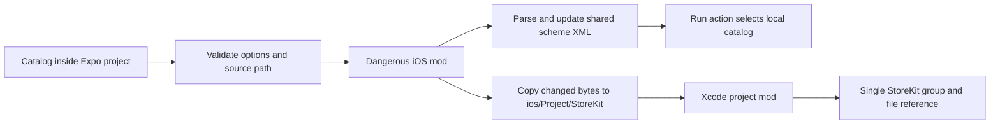

# expo-storekit-testing-plugin

[](https://github.com/luko13/expo-storekit-testing-plugin/actions/workflows/ci.yml)
[](LICENSE)

An Expo config plugin that wires a local `.storekit` catalog into the **Run** action of an iOS shared scheme. It is intended for projects that use [Expo Continuous Native Generation (CNG)](https://docs.expo.dev/workflow/continuous-native-generation/) and want repeatable local StoreKit Testing setup after `expo prebuild`.

The plugin has one job: copy a catalog into the native iOS project, make it visible in Xcode, and select it for the chosen shared scheme. It does not implement purchases or change application runtime code.

## Why this exists

This project grew out of my work on MMENTO, a private Expo app built with Continuous Native Generation. While testing its iOS purchase flow locally, I had to keep three pieces of native configuration aligned: the StoreKit catalog, its Xcode project reference, and the catalog selected by the shared Run scheme.

That setup is easy to perform once in Xcode, but manual changes are disposable when `ios/` is regenerated. An app-specific config plugin solved the immediate problem, while also making the reusable boundary clear: the catalog and scheme wiring belong in prebuild; product-specific purchase logic does not.

This package is the general version of that lesson. It was designed from scratch around a narrow contract: the consuming app provides a `.storekit` file and, optionally, a shared scheme name; the plugin restores the same native setup on every prebuild. It contains no MMENTO source code, configuration, identifiers, products, or paths.

## Installation

The package is preparing its first npm release. After `0.1.0` is published:

```sh
npm install expo-storekit-testing-plugin
```

Create a local StoreKit configuration file with Xcode and keep it inside the Expo project. For example:

```text
storekit/
└── Local.storekit
```

Then add the plugin to the Expo app configuration:

```json
{
  "expo": {
    "plugins": [
      [
        "expo-storekit-testing-plugin",
        {
          "configurationFile": "storekit/Local.storekit"
        }
      ]
    ]
  }
}
```

Run prebuild:

```sh
npx expo prebuild --platform ios
```

The default scheme is the native project name calculated by Expo. If the app uses another shared scheme, select it explicitly without the `.xcscheme` extension:

```json
[
  "expo-storekit-testing-plugin",
  {
    "configurationFile": "storekit/Local.storekit",
    "scheme": "ExampleDevelopment"
  }
]
```

The selected scheme must already exist in the native project's `xcshareddata/xcschemes` directory when the plugin runs.

## API

```ts
export interface StoreKitTestingPluginProps {
  configurationFile: string;
  scheme?: string;
}
```

| Property            | Required | Description                                                                                                    |
| ------------------- | -------- | -------------------------------------------------------------------------------------------------------------- |
| `configurationFile` | Yes      | Path to an existing regular `.storekit` file, relative to and contained within the Expo project root.          |
| `scheme`            | No       | Existing shared Xcode scheme name without `.xcscheme`. Defaults to the native project name calculated by Expo. |

Invalid options stop prebuild with an error prefixed by `[expo-storekit-testing-plugin]`. The plugin rejects empty values, absolute or escaping catalog paths, non-`.storekit` paths, missing files, directories in place of files, scheme paths, scheme filenames with the `.xcscheme` suffix, malformed scheme XML, schemes without a `LaunchAction`, and missing shared schemes.

## Native changes

Given a native project named `Example` and `storekit/Local.storekit`, prebuild changes the iOS project as follows:

```text
# Before
storekit/Local.storekit
ios/Example.xcodeproj/xcshareddata/xcschemes/Example.xcscheme

# After
storekit/Local.storekit
ios/Example/StoreKit/Configuration.storekit
ios/Example.xcodeproj/project.pbxproj
ios/Example.xcodeproj/xcshareddata/xcschemes/Example.xcscheme
```

The scheme's `LaunchAction` contains exactly one StoreKit reference:

```xml
<LaunchAction ...>
  <StoreKitConfigurationFileReference
    identifier="../Example/StoreKit/Configuration.storekit">
  </StoreKitConfigurationFileReference>
  <!-- Existing launch arguments, environment variables, and other nodes remain. -->
</LaunchAction>
```

In `project.pbxproj`, the plugin creates or reuses a `StoreKit` group under the native app group and adds one visible `Configuration.storekit` file reference. The file intentionally has no target membership and is not added to **Copy Bundle Resources** because Xcode's local StoreKit test environment reads it through the Run scheme.

The fixed destination is updated only when the source bytes change. Repeated prebuilds do not add duplicate Xcode groups, file references, or scheme nodes.

## Architecture



The scheme is parsed and serialized through Expo's structured XML API. Existing attributes and unrelated nodes are preserved. The Xcode project is changed through its project APIs rather than by editing `project.pbxproj` as raw text.

## CNG lifecycle

Expo recommends config plugins for native changes that need to be reapplied by CNG. This package therefore treats `ios/` as derived native output:

- The first prebuild copies the catalog and configures the project and scheme.
- A later prebuild updates the copied catalog if the source content changed.
- Running prebuild again is idempotent after the first XML normalization.
- Removing the plugin from the app configuration does not delete artifacts left by an earlier run. Use `npx expo prebuild --clean --platform ios` to recreate the native project without them.

`--clean` deletes and recreates native project files. Preserve any manual native work before running it. See Expo's [CNG guide](https://docs.expo.dev/workflow/continuous-native-generation/), [config plugin introduction](https://docs.expo.dev/config-plugins/introduction/), and [library plugin development guide](https://docs.expo.dev/config-plugins/development-for-libraries/).

## Verify in Xcode

1. Open the generated workspace under `ios/` in Xcode.
2. Confirm that **StoreKit > Configuration.storekit** appears in the Project navigator.
3. Choose **Product > Scheme > Edit Scheme**.
4. Select **Run**, then **Options**.
5. Confirm that **StoreKit Configuration** points to `Configuration.storekit`.
6. Run the app from Xcode and use **Debug > StoreKit > Manage Transactions** when a scenario needs inspection or control.

Apple documents this setup in [Setting up StoreKit Testing in Xcode](https://developer.apple.com/documentation/xcode/setting-up-storekit-testing-in-xcode/) and [Testing in-app purchases with the StoreKit transaction manager](https://developer.apple.com/documentation/xcode/testing-in-app-purchases-with-storekit-transaction-manager-in-code).

## Local StoreKit Testing, sandbox, and TestFlight

These environments serve different stages of purchase testing:

| Environment               | Product data                                                                                                 | Execution                                                                           | What this plugin configures |
| ------------------------- | ------------------------------------------------------------------------------------------------------------ | ----------------------------------------------------------------------------------- | --------------------------- |
| StoreKit Testing in Xcode | Local `.storekit` catalog; App Store Connect is not required                                                 | App launched with the configured Xcode Run scheme                                   | Yes                         |
| Sandbox                   | In-app purchases configured in App Store Connect; transactions use Apple's sandbox services                  | Development testing with the sandbox environment and test accounts where applicable | No                          |
| TestFlight                | Beta build and in-app purchases distributed through App Store Connect; purchases use the sandbox environment | Installed TestFlight build                                                          | No                          |

The catalog selection is a property of the Xcode **Run** action. It is not an archive setting, is not embedded as an app resource, and is not a mechanism for EAS Build archives or TestFlight. Use sandbox or TestFlight testing when the test needs App Store-signed transaction data, App Store Connect product configuration, server notifications, or beta distribution. Apple's [testing stages overview](https://developer.apple.com/documentation/storekit/testing-at-all-stages-of-development-with-xcode-and-the-sandbox) compares these environments in detail.

## Compatibility

| Component | Supported range                                            |
| --------- | ---------------------------------------------------------- |
| Expo      | `>=54 <58`                                                 |
| Node.js   | `>=20.19.4`; also meet the selected Expo SDK's requirement |
| Platform  | iOS native project generated by Expo CNG                   |
| Xcode     | The minimum version required by the selected Expo SDK      |

Plugin evaluation and iOS project generation with `expo prebuild` do not inherently require macOS or Xcode; this repository verifies those steps on Ubuntu for Expo SDK 54 through 57. macOS and Xcode are required to open or compile the generated project, run the StoreKit Testing environment, use StoreKitTest, and perform the native Xcode validations. Expo SDK 57 itself requires Node.js `>=22.13.0`; earlier supported SDKs are tested with Node.js `20.19.4`.

## Limitations

- Local StoreKit Testing only. The plugin does not configure sandbox, TestFlight, App Store Connect, or production.
- Run schemes only. It makes no changes or guarantees for Archive actions or EAS archives.
- No purchase APIs, StoreKit 2 integration, receipt validation, entitlement logic, or server behavior.
- One fixed native destination and one selected shared scheme per plugin invocation.
- The source catalog must already exist. The plugin validates its location and file type, but does not interpret Apple's catalog contents.
- Removing the plugin requires a clean prebuild to remove prior native artifacts.

## Security

- The configured `configurationFile` path must remain inside the Expo project root; absolute paths and parent-directory traversal are rejected.
- The catalog is copied only to `ios/<projectName>/StoreKit/Configuration.storekit`.
- The plugin does not contact external services, read App Store credentials, or manage secrets.
- Treat local catalogs as source files: review their contents before committing them and do not place credentials or private customer data in them.
- Release automation is designed for [npm Trusted Publishing](https://docs.npmjs.com/trusted-publishers/) with short-lived OIDC credentials rather than a persistent npm publish token.

## Troubleshooting

### `StoreKit configuration file not found`

Resolve `configurationFile` from the directory that contains the Expo app configuration. The file must exist before prebuild starts and remain inside that project root.

### `configurationFile must point to a regular file`

Point the option to a `.storekit` file, not to its containing directory.

### `Shared Xcode scheme ... was not found`

Check the scheme name in Xcode and make sure it is shared. Pass only the name, without a path or `.xcscheme`. If the scheme is created by another config plugin, ensure it exists before this plugin's dangerous iOS mod runs.

### `Could not parse the Xcode scheme XML`

Open the `.xcscheme` file in Xcode or an XML validator and repair malformed XML. The plugin does not fall back to text replacement.

### `Xcode scheme has no LaunchAction`

The selected scheme cannot activate StoreKit Testing without a Run action. Add a Run action in Xcode or select another shared scheme.

### The catalog remains after removing the plugin

Run:

```sh
npx expo prebuild --clean --platform ios
```

This recreates the iOS project from the current Expo configuration, so preserve manual native changes first.

### The catalog is configured locally but not in TestFlight

This is expected. The plugin selects the catalog only for Xcode's Run action. Configure products in App Store Connect and use the sandbox/TestFlight workflow for distributed builds.

## Development and testing

```sh
npm ci
npm run format:check
npm run lint
npm run typecheck
npm test
npm run build
npm run pack:audit
npm run example:prebuild
```

The test suite covers option validation, structured scheme transformation, Xcode project changes, file copying, changed source content, error handling, and idempotence. CI also exercises the packed package against supported Expo SDK versions. A macOS job validates the example catalog with StoreKitTest and checks that Xcode can load the generated project and shared scheme.

## Contributing

1. Open an issue describing the problem or narrowly scoped change.
2. Install dependencies with `npm ci`.
3. Add or update tests for behavioral changes.
4. Run every command in [Development and testing](#development-and-testing).
5. Submit a focused pull request and document any user-facing behavior change in `CHANGELOG.md`.

Keep the package focused on deterministic local StoreKit Testing setup for Expo CNG. Features for purchase execution, server validation, sandbox accounts, TestFlight, or archive-time behavior belong outside this plugin.

## Release policy

Releases follow Semantic Versioning. Version `0.1.0` must first be published once by the maintainer because npm can configure a Trusted Publisher only after the package exists. After completing every validation command above, bootstrap it from a trusted local environment with interactive 2FA using `npm publish --access public --no-provenance`. The explicit override is required because npm provenance is available only from supported hosted CI providers. Then configure the package's npm Trusted Publisher for this repository's `release.yml` workflow and `npm` environment. Subsequent releases use short-lived OIDC credentials and provenance from an explicitly dispatched stable SemVer tag. Prerelease tags are rejected so they cannot be promoted to npm's `latest` channel accidentally; no persistent npm publish token is required.

## License

[MIT](LICENSE) © 2026 Luis.
